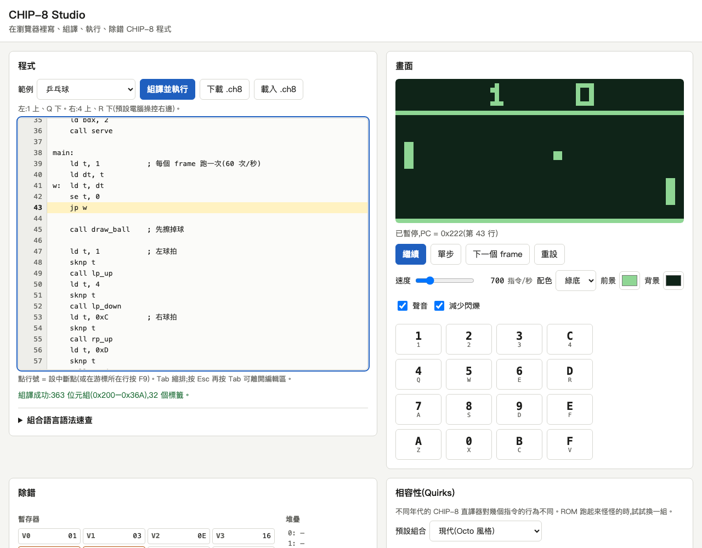

# CHIP-8 Studio
A browser-based CHIP-8 emulator, assembler, disassembler and step debugger, with zero dependencies.

在瀏覽器裡寫、組譯、執行、除錯 CHIP-8 程式。純靜態網頁,不需要建置,也不用安裝任何套件。

**Demo:** https://useless-husband.github.io/chip8-studio/



## 是什麼

CHIP-8 是 1970 年代為 COSMAC VIP 設計的虛擬機器:64×32 單色畫面、16 個 8 位元暫存器、35 個指令,是學習「CPU 到底在做什麼」最小的題材之一。

這個專案把整個開發循環放進一個網頁:左邊寫組合語言,按一個鍵組譯並執行,右邊看畫面,下面看暫存器、堆疊、記憶體,還能設中斷點單步執行。

## 功能

- **完整模擬器**:35 個標準指令全部實作,60Hz 計時器、可調 CPU 速度(100–3000 指令/秒)、WebAudio 嗶聲。
- **Quirks 切換**:位移用 VX 或 VY、FX55/FX65 是否遞增 I、BNNN 是否用 VX、邏輯運算後 VF 是否歸零、畫圖是否等待垂直空白、超出畫面是裁切還是繞回。有 COSMAC VIP / 現代 / SUPER-CHIP 三組預設。
- **SUPER-CHIP**:128×64 高解析度、`DXY0` 16×16 sprite、大字型、上下左右捲動、`FX75`/`FX85`。
- **組譯器**:標籤、`.equ` 常數、`.reg` 暫存器別名、`.db`/`.dw`/`.ds`/`.org`、十六進位/二進位字面值、運算式,以及用圖案直接畫 sprite 的 `.px`。錯誤訊息有行號與中文說明,一次列出所有錯誤。
- **反組譯器**:輸出的語法和組譯器完全一致,65536 種 opcode 都能來回轉換。
- **網頁 IDE**:行號、Tab 縮排、點行號設中斷點、單步 / 下一個 frame / 繼續 / 暫停 / 重設、目前指令與後續反組譯、記憶體檢視。
- **輸入**:鍵盤 `1234 / QWER / ASDF / ZXCV`,以及可觸控的 16 鍵螢幕鍵盤(手機可玩)。
- **檔案**:載入本機 `.ch8`(會自動反組譯進編輯器)、下載組譯出的 `.ch8`。
- **5 個原創範例**:彈跳球、乒乓球(可對電腦或雙人)、貪食蛇、字型與鍵盤測試、SUPER-CHIP 高解析度示範。沒有附任何有版權的 ROM。
- 畫面以整數倍縮放、邊緣清晰,可切換 5 種實色配色或自訂前景/背景色;支援淺色與深色模式。

## 安裝與執行

只需要一個瀏覽器。因為使用 ES module,不能直接雙擊 `index.html`,要用本機網頁伺服器開啟。

1. 下載程式碼(或用 git):

   ```sh
   git clone https://github.com/useless-husband/chip8-studio.git
   cd chip8-studio
   ```

2. 啟動伺服器(macOS 與大多數 Linux 內建 Python 3):

   ```sh
   python3 -m http.server 8000
   ```

   Windows 如果沒有 `python3`,改用 `py -m http.server 8000`。

3. 用瀏覽器開啟 http://localhost:8000/。

要跑測試才需要 Node.js 20 以上(見下方)。

## 使用方式

1. 開啟網頁後會自動載入「彈跳球」並開始執行。從「範例」選單換其他程式。
2. 點一下畫面,用鍵盤操作(乒乓球:`1` / `Q` 控制左邊球拍;貪食蛇:`W A S D`)。手機用畫面上的 16 鍵。
3. 直接修改左邊的程式碼,按「組譯並執行」(或 Ctrl/⌘ + Enter)。有錯誤會列在編輯器下方,點一下跳到那一行。
4. 除錯:點行號設中斷點(或游標在該行按 F9),程式跑到那裡會停住。暫停時可以「單步」(F10)或「下一個 frame」(計時器會減 1)。

### 組合語言範例

```asm
.reg x v0
.reg y v1

start:
    ld x, 28
    ld y, 12
    ld i, box
    drw x, y, 4        ; 在 (28, 12) 畫一個方塊
forever:
    jp forever

box:
    .px "####"
    .px "#..#"
    .px "#..#"
    .px "####"
```

組譯結果(`ld [i]` 這類寫法完整清單見網頁內的「組合語言語法速查」):

```
0x200  603C   ld v0, 0x1C
0x202  610C   ld v1, 0x0C
0x204  A20A   ld i, 0x20A
0x206  D014   drw v0, v1, 4
0x208  1208   jp 0x208
0x20A  F0 90 90 F0   (sprite 資料)
```

錯誤訊息長這樣:

```
第 2 行:不認得的指令「foo」
第 3 行:數值 999 放不進 1 個位元組(範圍 -128 ~ 255)
第 7 行:未定義的符號「nowhere」
```

### 語法重點

| 寫法 | 意思 |
| --- | --- |
| `; 註解` | 分號之後都是註解 |
| `name:` | 標籤,可以獨立一行或接指令 |
| `.equ NAME, 值` | 常數 |
| `.reg name v3` | 暫存器別名 |
| `.db 1, 0x2, 0b11, "hi"` / `.dw 0x1234` | 位元組 / 16 位元資料 |
| `.px "..##..##"` | 用像素畫 sprite,`#` 是亮點;9–16 字元會變成 2 個位元組 |
| `.ds N` / `.org 位址` | 保留 N 個位元組 / 補到指定位址 |

指令的拼法沿用常見的 CHIP-8 助記符:`cls ret jp call se sne ld add or and xor sub subn shr shl rnd drw skp sknp`,加上 SUPER-CHIP 的 `high low scd scr scl exit`。`ld` 有 `ld vx, dt`、`ld dt, vx`、`ld st, vx`、`ld vx, k`、`ld f, vx`、`ld hf, vx`、`ld b, vx`、`ld [i], vx`、`ld vx, [i]`、`ld r, vx`、`ld vx, r`。

## 專案結構

```
index.html        網頁入口
style.css         樣式(淺色/深色)
src/cpu.js        模擬器核心(CHIP-8 + SUPER-CHIP、quirks)
src/assembler.js  兩趟式組譯器
src/disassembler.js  反組譯器
src/runner.js     以 frame 為單位推進模擬器(含中斷點)
src/app.js        網頁介面(編輯器、除錯面板、輸入、音效)
src/keymap.js     鍵盤對照
src/themes.js     畫面配色
src/examples.js   範例清單
examples/         範例程式(*.c8asm)
test/             測試(node:test)
docs/screenshot.png
```

## 如何跑測試

```sh
npm test
```

不需要 `npm install`,沒有任何依賴。測試涵蓋:每個 opcode(進位/借位旗標、BCD、碰撞、裁切與繞回、SUPER-CHIP 捲動)、組譯器編碼與錯誤訊息、65536 種 opcode 的反組譯再組譯來回一致、所有範例組譯成功並在三組 quirks 下跑 5 秒不當機、範例遊戲的實際行為(球拍移動、貪食蛇吃食物與撞牆等)。GitHub Actions 會在每次推送時執行同樣的測試。

## 原理簡介

- `Chip8.step()` 每次取一個 16 位元指令,依高 4 位元分派。`tick()` 代表一次 60Hz 的垂直空白:計時器減 1,並解除「畫圖等待」。網頁每個 frame 執行 `速度 ÷ 60` 個指令再 tick 一次。
- `FX0A` 需要「按下再放開」才算輸入,和原版一致。
- 組譯器第一趟只算每一行佔幾個位元組並蒐集標籤和常數,第二趟才編碼,所以標籤可以往後參照。所有錯誤都收集起來一次回報。
- 組譯結果附帶「行號 ↔ 位址」對照表,除錯面板用它把 PC 對回原始碼行、把中斷點行對回位址。
- 反組譯器對無法辨識的 opcode 輸出 `.dw 0xNNNN`,所以任何位元組序列都能反組譯後再組譯回原樣。
- 「減少閃爍」選項把上一個 frame 的亮點多顯示一個 frame。CHIP-8 遊戲常用「擦掉再重畫」移動 sprite,兩者剛好落在不同 frame 時就會閃,這個選項只影響顯示,不影響模擬。

## 授權

MIT,見 [LICENSE](LICENSE)。
